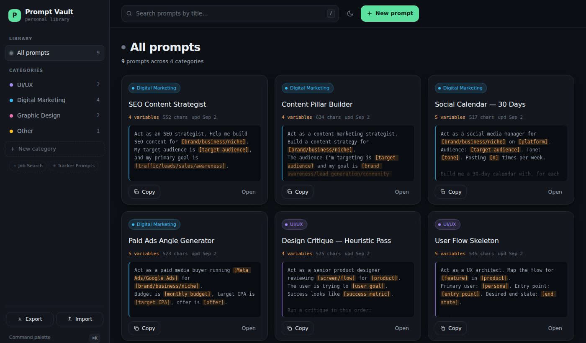

# Prompt Vault

A personal library for AI prompts. Single user, runs on your own machine,
stores everything in a local SQLite file.

```bash
npm install
npm start          # → http://127.0.0.1:4000
```



First run seeds four categories and nine example prompts so the app opens in a
working state. They are examples — delete them. Skip the seed with `SEED=0 npm start`.

---

## What it does

**Prompts** — create, read, edit, delete. Delete always asks first.
Title, full text, one category, created and updated dates kept automatically.

**Categories** — four to start (UI/UX, Digital Marketing, Graphic Design, Other),
but they are rows in a table, not constants. Add, rename and recolour them from
the sidebar. Job Search and Tracker Prompts are pre-staged as one-click chips.
Deleting a category never deletes its prompts — they move to **Uncategorised**.

**Search** — live filter by title as you type, scoped to the category you are in.
Every category shows its prompt count.

**Copy** — one click per card, with `Copied!` feedback for two seconds.

**Variables** — text in `[square brackets]` is treated as a fillable variable.
The app highlights them, counts them per prompt, and **Fill variables…** lets you
type the values once and copy the finished text. Blank fields keep their brackets,
so a half-filled prompt is still usable.

**Export / import** — `Export` downloads the whole library as JSON.
`Import` takes it back, two ways:

| Mode | What happens |
| --- | --- |
| **Merge** (default) | Adds what is missing, updates anything the file has a newer copy of. Nothing you have is deleted. A category that already exists by name is reused, not duplicated. |
| **Replace** | Wipes the library and restores the file. Asks for confirmation naming exactly what will be lost. |

**Keyboard** — `⌘K`/`Ctrl+K` command palette, `/` search, `N` new prompt,
`⌘↵` save, `Esc` close.

**Themes** — dark by default, light on the toggle, choice remembered per browser.
Responsive to mobile, where the sidebar becomes a drawer.

---

## Layout

```
server/
  index.js    Express app, static hosting, error handling
  api.js      the JSON API — validation lives here
  db.js       SQLite schema, migrations, every query
  seed.js     first-run example content
  reset.js    npm run reset — backs up, then wipes the database
public/
  index.html  markup
  styles.css  design tokens + components
  app.js      UI logic and API client
data/
  vault.db    your library (gitignored — it is your data, not the project's)
mockup/       the original design mockup, no server needed
```

## API

| Method | Route | Notes |
| --- | --- | --- |
| `GET` | `/api/state` | Whole library in one call. This is what the app boots on. |
| `GET/POST` | `/api/categories` | |
| `PATCH/DELETE` | `/api/categories/:id` | Delete orphans prompts, never removes them |
| `GET/POST` | `/api/prompts` | |
| `GET/PATCH/DELETE` | `/api/prompts/:id` | `PATCH` is partial |
| `GET` | `/api/export` | JSON backup, as a download |
| `POST` | `/api/import` | `{ payload, mode: "merge" \| "replace" }` |

Errors come back as `{ "error": "…" }` with a message written for a person —
the UI shows that string directly.

## Decisions worth knowing

- **The whole library is fetched once.** A personal prompt library is tens of
  rows. Searching and filtering in the browser is instant; only writes go to the
  server. If you ever have thousands of prompts, that is the thing to revisit.
- **Writes are confirmed before the screen updates.** Nothing is shown as saved
  until SQLite says it is, so what you see is what is stored.
- **The server binds to `127.0.0.1`.** There is no login, by design, so it must
  not listen on every interface — on shared wifi that would hand your library to
  anyone who guessed the port. `HOST=0.0.0.0` overrides it if you understand that.
- **Imports run in one transaction.** A bad file changes nothing.
- **Merge resolves conflicts by `updatedAt`.** A stale backup can never overwrite
  newer work.
- **Deleting a category is not deleting prompts.** Two different destructive
  actions, and only one of them loses content.

## Environment

| Variable | Default | |
| --- | --- | --- |
| `PORT` | `4000` | |
| `HOST` | `127.0.0.1` | Only change if you mean to expose it |
| `DB_PATH` | `data/vault.db` | Point it at a synced folder to back up automatically |
| `SEED` | on | `SEED=0` starts empty |

## Not built

Favourites, recently-used, sort options, tags, prompt versioning, duplicate
detection, full-text search across prompt bodies.
